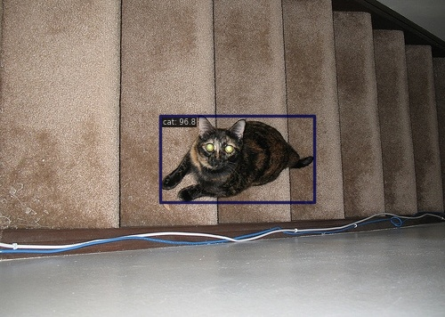

# Task 2：在VOC数据集上训练并测试模型 Mask R-CNN 和 Sparse R-CNN

### Subtask1：学习使用现成的目标检测框架——如 [mmdetection]([https://github.com/open-mmlab/mmdetectionLinks to an external site.](https://github.com/open-mmlab/mmdetection)) ——在VOC数据集上训练并测试目标检测模型 Mask R-CNN 和Sparse R-CNN

在该任务下，我们使用 mmdetection 提供的目标检测框架，mmdetection 是一个基于 PyTorch 的开源目标检测工具箱，提供了丰富的预训练模型和高效的训练 / 测试流程。

#### 数据集

本实验使用 Pascal VOC 2007 和 2012 数据集，该数据集包含 20 个目标类别。实验按照标准划分方式，将 2007 和 2012 的训练集与验证集合并作为训练数据 `voc0712_trainval`，共计 16551 张图像，2007 测试集作为验证数据 `voc07_test`，共计 4952 张图像。

实验需将 VOC 数据集转为 COCO 格式，COCO 格式的标注文件是 JSON 格式，主要包含三个部分`images`（图像信息）、`categories`（类别信息）以及`annotations`（标注信息）。

转化命令：

```python
python tools/dataset_converters/pascal_voc.py \
    data/VOCdevkit \
    --out-dir data/VOCdevkit/coco \
    --out-format coco
```

VOC 数据集类别：

```python
'aeroplane', 'bicycle', 'bird', 'boat', 'bottle', 'bus', 'car',
'cat', 'chair', 'cow', 'diningtable', 'dog', 'horse',
'motorbike', 'person', 'pottedplant', 'sheep', 'sofa',
'train', 'tvmonitor'
```

数据增强操作：在配置文件中采取如下数据增强操作

```python
train_pipeline = [
    dict(type='LoadImageFromFile', backend_args=None),
    dict(type='LoadAnnotations', with_bbox=True, with_mask=True),
    dict(
        type='RandomResize', 
        scale=[(1000, 600),(1200,700)], # 示例尺度范围，可调整
        keep_ratio=True,
        backend='pillow' # 或者 'cv2'
    ),
    dict(type='PhotoMetricDistortion'), # 添加颜色增强
    dict(type='RandomFlip', prob=0.5),
    dict(type='PackDetInputs')
]
```

其中：

- **RandomResize**：通过随机调整图像大小，模型能够学习到不同尺度下的特征。这有助于模型在面对不同大小的目标时，能够更准确地检测和识别。
- **PhotoMetricDistortion**：通过随机调整图像的亮度、对比度、饱和度等参数，模型能够学习到在不同光照条件下的特征。
- **RandomFlip**：通过随机水平翻转图像，模型能够学习到目标在不同方向下的特征。这有助于模型在面对目标方向变化时，能够更准确地检测和识别。

#### Mask R-CNN

Mask R-CNN 是一种用于目标检测和实例分割的深度学习模型。它基于 Faster R-CNN 架构，并增加了掩码预测分支，用于生成目标的边界框与分割掩码。实验使用的 Mask R-CNN 具体为 `mask_rcnn_r50_fpn`，主要组成部分包括：

- Backbone：使用 ResNet-50 作为主干网络，用于提取特征。
- Neck：使用 Feature Pyramid Network (FPN) 结构，将主干网络的特征图进行融合，生成多尺度的特征金字塔。
- RPN（Region Proposal Network）：用于生成候选区域。
- ROI Head：包括 BBox Head 和 Mask Head：
  - BBox Head：用于预测目标的边界框和类别。
  - Mask Head：用于预测目标的分割掩码。

关键训练参数设置如下，具体配置文件见 `mask-rcnn_r50_fpn_1x_voc.py`：


*   Batch Size：10（无预加载）、2（有预加载）


*   Learning Rate：0.0025


*   优化器：SGD（带动量 0.9，权重衰减 0.0001）


*   训练轮数：24 epochs


*   学习率调度：在第 16 和 22 个 epoch 时学习率衰减为原来的 0.1 倍。

在本实验中，我们训练了两个模型，分别为无预加载模型的 Mask R-CNN，有预加载模型的 Mask R-CNN。其中预加载的 Mask R-CNN 模型为 mmdetection 官方提供的，在 COCO 数据集上训练 36 epochs，且采用了多尺度训练（mstrain-poly） 的模型，具体为：

```
https://download.openmmlab.com/mmdetection/v2.0/mask_rcnn/mask_rcnn_r50_fpn_mstrain-poly_3x_coco/mask_rcnn_r50_fpn_mstrain-poly_3x_coco_20210524_201154-21b550bb.pth
```

#### Sparse R-CNN

Sparse R-CNN 是一种新型的目标检测架构，它通过学习稀疏的提议（proposals）来实现端到端的目标检测，与 Mask R-CNN 不同，Sparse R-CNN 仅生成目标的分割掩码。实验使用的 Sparse R-CNN 具体为 `sparse_rcnn_r50_fpn`，主要组成部分包括：

- Backbone：使用 ResNet-50 作为主干网络，用于提取特征。
- Neck：使用 Feature Pyramid Network (FPN) 结构，将主干网络的特征图进行融合，生成多尺度的特征金字塔。
- RPN_Head：使用 EmbeddingRPNHead 作为 RPN 头部，它通过学习嵌入向量来生成提议框。
- DII_Head（Dynamic Instance Interactive Head）：这是 Sparse R-CNN 的核心贡献。对于每个提议框，网络会提取对应的 RoI 特征，并将其输入到一个独立的头部中进行目标定位和分类。每个头部都依赖于特定的提议特征。

关键训练参数设置除 batch size 为 8 外与 Mask R-CNN 一致，具体配置文件见 `sparse-rcnn_r50_fpn_1x_voc.py`。

在本实验中，我们训练了有预加载模型的 Sparse R-CNN。其中预加载的 Sparse R-CNN 模型为 mmdetection 官方提供的，在 COCO 数据集上训练 12 epochs 的模型，具体为：

```
https://download.openmmlab.com/mmdetection/v2.0/sparse_rcnn/sparse_rcnn_r50_fpn_1x_coco/sparse_rcnn_r50_fpn_1x_coco_20201222_214453-dc79b137.pth
```

#### 实验结果与分析

#####  实验结果

在训练过程中，我们记录了训练集和验证集上的损失曲线和 mAP 曲线，结果如下图所示。

无预加载模型的 Mask R-CNN：


有预加载模型的 Mask R-CNN：


有预加载模型的 Sparse R-CNN：


在 VOC 数据集上，对所有模型的最终性能进行比较，结果如下表所示。

|           模型           | bbox_mAP | segm_mAP |
| :----------------------: | :------: | :------: |
|  Mask R-CNN（无预加载）  |  0.5360  |  0.5360  |
|  Mask R-CNN（有预加载）  |  0.6310  |  0.6290  |
| Sparse R-CNN（有预加载） |  0.6460  |    -     |

从图表中可以看出：

- **Mask R-CNN**
    - 无预加载模型：在训练初期，该模型的损失值处于较高水平，但随着训练的不断推进，损失值呈现出逐渐下降的趋势，与此同时，其mAP（平均精度均值）也在稳步上升，但整体收敛速度较慢。
    - 有预加载模型：借助预训练权重的优势，该模型在训练初期的损失值便处于较低水平，且收敛速度明显加快，在训练过程中，mAP能够始终保持在较高水平，并且最终的性能表现优于无预加载模型。
    - 有预加载模型在 mAP 和其他性能指标上均优于无预加载模型，这表明预训练权重对于提升模型性能具有显著作用。
- **Sparse R-CNN**
    - 有预加载模型： Sparse R-CNN 模型在 VOC 数据集上同样表现出色，其 mAP 和其他性能指标均达到了较高水平。这说明即使稀疏提议减少了候选区域的数量，Sparse R-CNN 模型具有较强的适应性和准确性，能够有效地识别和定位目标物体。
- 从训练过程中可以看出训练配置对训练过程的影响：
    - Batch Size：Batch Size 的大小对训练过程的稳定性有着显著影响。当 Batch Size 较小时，训练过程中的损失值和 mAP 等指标会出现较大的波动，这主要是因为小批量数据的代表性相对较弱，模型在每次更新时会受到较多的随机干扰。而当 Batch Size 较大时，训练过程中的波动则会明显减小，整体更加稳定，这是因为大批量数据能够更好地反映数据的整体分布情况，使模型的更新更加平滑和准确。这一点在有无预加载模型的 Mask R-CNN 对比中表现得尤为明显。
    - 学习率调度：在训练过程中，三个模型在第 16 个 epoch 附近都出现了 loss 较大幅度下降以及 mAP 较大幅度上升的现象。这主要是因为学习率在第 16 个 epoch 时进行了调整，衰减为原来的 0.1 倍。当模型训练到一定程度后，较大的学习率可能导致模型更新幅度过大，从而无法精确地收敛到最优解。而将学习率降低后，模型能够以更小的步长进行调整，更有利于对细节的学习和优化，进而使得模型的性能得到进一步提升。

##### 结果分析

通过在 VOC 数据集上训练有无预加载模型的 Mask R-CNN 和 Sparse R-CNN，我们得出以下结论：

##### （一）预训练权重的影响

- **知识迁移**：COCO 数据集包含 VOC 数据集中所有类别，因此在 COCO 数据集上预训练的模型已经学习到了丰富的特征表示和目标检测知识。当将这些预训练权重迁移到 VOC 数据集上时，模型能够更快地适应新任务，从而提高训练效率和最终性能。
- **特征提取能力**：预训练模型在 COCO 数据集上学习到的特征提取能力对于 VOC 数据集上的任务同样有效。这些特征能够更好地捕捉目标的形状、纹理等信息，有助于提高模型的检测和分割性能。
- **数据规模**：COCO 数据集包含 VOC 数据集中所有类别，且数据规模远超 VOC 数据集。实验过程中观察到，直接使用预加载模型的 Mask R-CNN 在 VOC 数据集上，未经过进一步微调的模型就已经比无预加载模型的 Mask R-CNN 的最终训练结果优，且预加载模型的训练轮数为 12，仅为无预加载模型的一半。更大的数据集提供了更多的样本来学习数据的多样性和复杂性，从而提高模型的泛化能力，同时可以减少训练过程中的波动，使训练过程更加稳定。

##### （二）模型结构的差异

- **Mask R-CNN**：作为一种经典的目标检测和实例分割模型，Mask R-CNN 在 VOC 数据集上表现出更加稳定的性能。这是由于在 RPN_Head 部分使用了更密集的 proposal 生成策略，且在 RoI Head 包括了 BBox Head （边界框回归）和 Mask Head（掩码预测）两个分支。这提高了计算复杂度，但同时提高了分割掩码的质量和泛化能力，使其能够高精度处理各种大小和形状的目标。
- **Sparse R-CNN**：Sparse R-CNN 通过学习稀疏的提议和动态实例交互头部来实现高效的检测和分割。其稀疏提议和动态实例交互头部的独特结构显著减少了计算量，提高了检测和分割的效率。但是稀疏提议减少了候选区域的数量，在某些复杂场景下可能不如 Mask R-CNN 稳定。

（这里模型结构差异带来的影响可视化详见 subtask2）

### Subtask2：挑选4张测试集中的图像，通过可视化**对比**训练好的Mask R-CNN第一阶段产生的proposal box和最终的预测结果，以及Mask R-CNN 和Sparse R-CNN的**实例分割**与**目标检测**可视化结果；

在测试集 `voc07_test` 中随机挑选 4 张图像，可视化对比 Mask R-CNN 第一阶段产生的 proposal box 和最终的预测结果。

原图如下：

 

 

无预加载模型的 Mask R-CNN：

第一阶段产生的 proposal box ：

 

 

最终的预测结果：

 

 

有预加载模型的 Mask R-CNN：

第一阶段产生的 proposal box ：

 

 

最终的预测结果：

 

 

有预加载模型的 Sparse R-CNN：

 

 

从可视化结果可以观察到：

- Mask R-CNN 提议阶段仅生成 proposal box 以及对应得分，不对框内物体类别进行识别，仅区分前景（类别物体）与背景。该阶段生成的大量的 proposal box ，这些 proposal box 能够较好地覆盖目标物体，但存在一定数量、重叠区域大的冗余框。针对此类高度重叠的提议框， Mask  R-CNN 采取了非极大值抑制（non-maximum suppression），从最终结果中可以看出这一方法有效减少重叠的检测框，保留最佳的检测结果。
- 对比无预加载模型的 Mask R-CNN 和有预加载模型的 Mask R-CNN 可以发现，有预加载模型的 Mask R-CNN 性能更好，主要体现在最终保留的 proposal box 数量更少更简洁，识别得分更高更准确。比如第四张图中的摩托车，无预加载模型的 Mask R-CNN仍然保留了一个没有完全覆盖摩托车的低分数的 proposal box，而有预加载模型的 Mask R-CNN 则除去了这个 proposal box。
- 相比 Mask R-CNN ，Sparse R-CNN 的检测结果则相对更简洁，这显然是其稀疏提议的独特结构。但是相应的，面对复杂图像，比如第一张和第四张，其 bounding box 得分就低于 Mask R-CNN，即置信度更低。不过同样面对复杂图像，Mask R-CNN 最后保留的 box 数量更多，比如第一张图片有预加载模型的 Mask R-CNN 面对画面中下部的牛，保留了三个高重叠度的不同类别的框。这一点可以通过提高非极大值抑制的阈值来调节。

总的来说，对比两种模型，Mask R-CNN 在小目标检测和实例分割的细节处理上表现更好，置信度更高，而 Sparse R-CNN 的检测结果相对更简洁。

### Subtask3：搜集三张不在VOC数据集内包含有VOC中类别物体的图像，分别可视化并比较两个在VOC数据集上训练好的模型在这三张图片上的目标检测/实例分割结果（展示bounding box、instance mask、类别标签和得分）；

搜集三张不在 VOC 数据集内但包含 VOC 中类别物体的图像，subtask3 仅采用有预加载模型的 Mask R-CNN 以及有预加载模型的 Sparse R-CNN 进行比较，结果如下图所示。

原图：

 


有预加载模型的 Mask R-CNN：

 


有预加载模型的 Sparse R-CNN：

 


此外再展示一组有预加载模型的 Mask R-CNN 的图片：

 

实验结果表明：


- 两种模型对常见类别的检测效果均比较好。
- 但对于一些姿态特殊或遮挡严重的物体，两种模型的检测精度都有所下降。比如第三张图片以及额外的一组图片中，都出现了抬头的猫，Mask R-CNN 准确识别了第三张图片中的猫，但在额外的一组图片中，识别为猫的提议框得分仅 85，还出现了冗余的提议框，且识别为狗。


- Mask R-CNN 在小目标和复杂场景下的实例分割效果更精细，能够准确区分相邻的物体，性能优于 Sparse R-CNN。比如 Mask R-CNN 识别出了图一中画面右侧的盆栽，Sparse R-CNN 则没有。
- 而面对极复杂图像，两种模型效果仍有待提高，如图二，虽然 Mask R-CNN 依然比 Sparse R-CNN 多识别出一些人、汽车与巴士，但是两种模型都没能完全识别出远景中的车辆以及路边的人。


